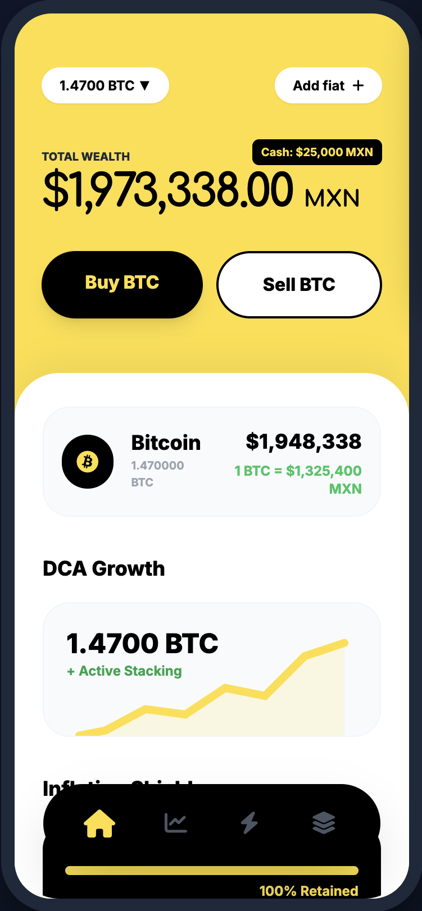
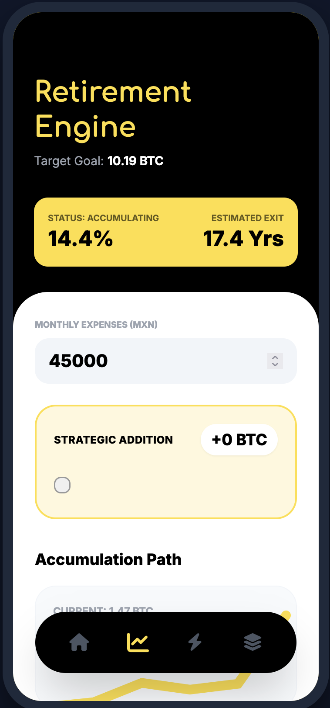
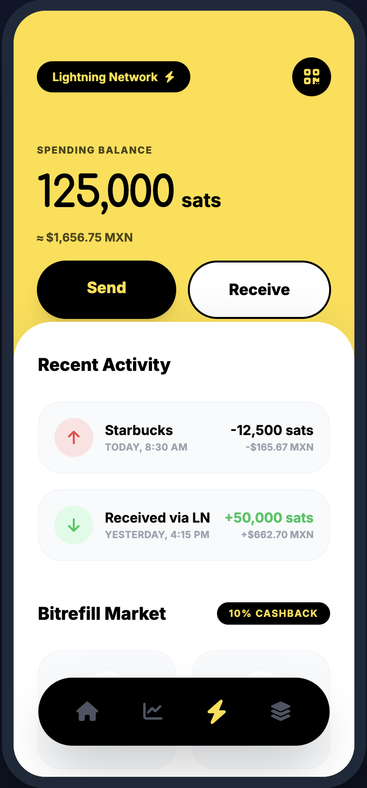

# 🚀 To The Moon

### Sovereign Bitcoin Finance for the Post-Fiat Era

> Mobile-first Bitcoin financial operating system powered by Lightning Network infrastructure, inflation analytics, and sovereign wealth automation.

---

# 🌐 Live Experience

| Destination | Link |
|---|---|
| 📱 Mobile Prototype | https://gmartinezgil.github.io/to-the-moon/mobile |

---

# 📸 Screenshots

## Dashboard

## FIRE Retirement Engine

## Lightning Wallet

---

# 🧠 What Is To The Moon?

To The Moon is a sovereign Bitcoin-native financial operating system designed to help users transition from fiat dependency to long-term Bitcoin wealth accumulation.

The platform combines:
- Bitcoin DCA analytics
- FIRE retirement projections
- Lightning Network commerce
- Inflation erosion monitoring
- BTC-native financial tooling

---

# 🏗 Presentation

---

# ⚡ Features

- 📈 Bitcoin DCA Visualization
- ⚡ Lightning Network Payments
- 🔥 FIRE Retirement Engine
- 🛡 Inflation Shield Analytics
- 🏦 BTC Collateral Loan Calculator
- 🌎 Global Sovereign Payments

---

# 🛠 Technology Stack

- React 18
- Tailwind CSS
- Lightning Network
- CoinGecko APIs
- Mempool APIs
- Bitcoin-native architecture

---

# 🗺 Roadmap

| Stage | Features |
|---|---|
| Alpha | BTC Dashboard + DCA |
| Beta | Lightning Payments |
| V2 | Collaborative Custody |
| V3 | P2P Bitcoin Lending |

---

# 📚 Documentation & Presentation

- 📄 [Investor Deck](./docs/investor-deck.pdf)
- 📘 [Whitepaper](./docs/whitepaper.pdf)
- 🧠 [Architecture Notes](./docs/architecture.md)

---

Buil Day CDMX 2026 - bythelab* - FeDi - Aureo

Built for the Bitcoin Standard ⚡
